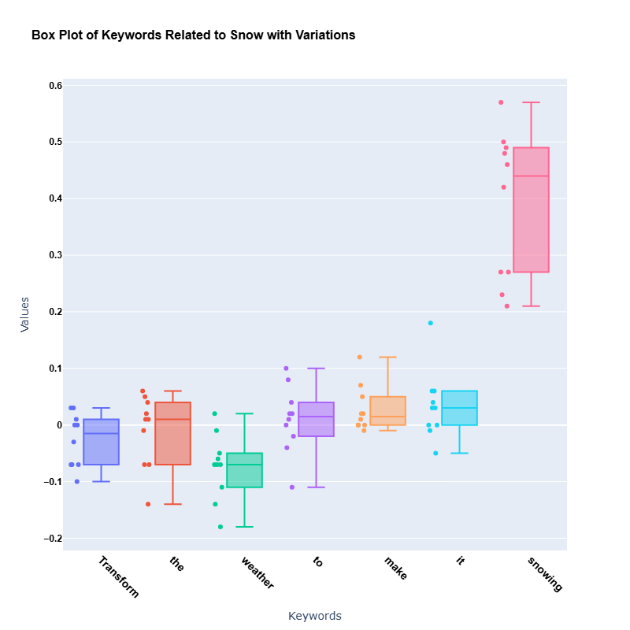

# t-SNE Plot in Notebooks

## Plot Description

In this project, the t-SNE technique was used to reduce the dimensionality of image embeddings. The plot below visualizes the 2D distribution of embeddings, showing clear clustering of data points based on different prompt keywords. These clusters highlight the separation between features corresponding to specific textual prompts and those with perturbed or non-specific prompts.

---

### Image Link

The t-SNE plot is saved in the following location:

[`docs/Figures/plot_tsne (2).jpg`](../Figures/plot_tsne%20(2).jpg)

---

### Code to Generate the t-SNE Plot

The following code snippet was used to display the t-SNE plot in a Jupyter Notebook:

# Box Plot Analysis

## Box Plot for Prompt: "Transform the weather to make it snowing"

The box plot below visualizes the distribution of word weights for each term in the prompt **"Transform the weather to make it snowing"** across 10 edited images with 30 perturbations. Key terms like **"snowing"** exhibit higher median weights and greater variability, highlighting their significant influence in the editing process compared to other words.

### Visualization

**Figure**: This box plot illustrates the distribution of word weights for each term in the given prompt.

### Code to Generate the Box Plot

The Jupyter Notebooks containing the code to generate this box plot are available in the following directory:  
[`docs/Notebooks/Box_plot_10images`](docs/Notebooks/Box_plot_10images)
